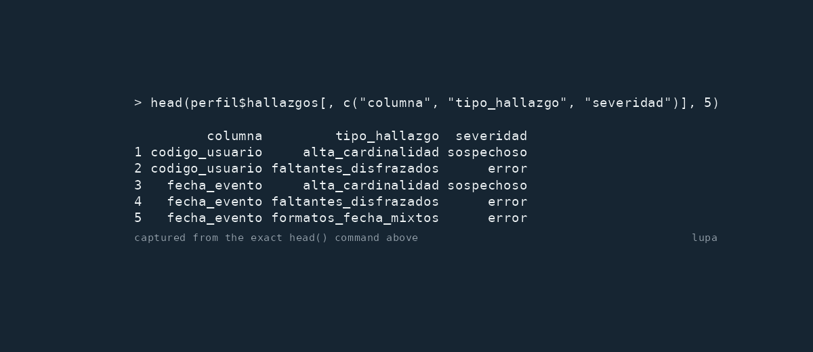

# lupa

[](https://www.gnu.org/licenses/gpl-3.0.html)
[](https://github.com/sebollin/lupa/actions/workflows/R-CMD-check.yaml)
[](https://www.repostatus.org/#active)
[](https://sebollin.github.io/lupa/README.md)

## 🔎 Qué es y en qué se distingue

`lupa` es un conjunto de herramientas auditables para conectar el primer
perfilado con un modelo de calidad declarado para un uso concreto,
mediciones explícitas, limpieza controlada de una copia y duplicados
aproximados a escala. En vez de un puntaje opaco, cada resultado
conserva alcance, evidencia e incertidumbre.

**Bases enteras, no una tabla sola.**
[`coleccion()`](https://sebollin.github.io/lupa/reference/coleccion.md)
declara qué tablas componen una base —con su esquema, porque el esquema
es parte de la identidad de la tabla— y
[`perfilar_coleccion()`](https://sebollin.github.io/lupa/reference/perfilar_coleccion.md)
devuelve una fila por tabla más la cobertura de lo que no pudo medir. La
frontera se *declara*, nunca se descubre: recorrer un catálogo
convertiría un error de permisos en un resultado, y una colección real
pasa de mil tablas repartidas en decenas de esquemas. Lo que una
credencial no puede leer va a `cobertura_coleccion` con su motivo,
**nunca a cero** —los permisos parciales son el caso normal, no el
borde—. Y no hay lectura instantánea: cada tabla trae el momento en que
se midió, y el objeto lo declara.

**Contradicciones que ninguna columna muestra sola.** Con
[`senal_redundante()`](https://sebollin.github.io/lupa/reference/senal_redundante.md)
se declara que varias columnas codifican el mismo hecho, y
[`detectar_discordancias()`](https://sebollin.github.io/lupa/reference/detectar_discordancias.md)
informa las filas donde no concuerdan: el año de la fecha contra el año
fiscal contra el año del archivo. Cada uno de los tres puede ser
plausible por su cuenta y aun así contradecir a los otros. El grupo se
declara, nunca se adivina: dos columnas de año pueden ser el de
nacimiento y el de ingreso, y no tienen por qué coincidir.

**Hallazgos que se pueden verificar, no sólo leer.** Pasale `clave` a
[`perfilar()`](https://sebollin.github.io/lupa/reference/perfilar.md)
con las columnas que identifican una fila, y la trazabilidad de cada
hallazgo trae esos valores para las filas que señala, así el caso se
busca en el sistema de origen sin abrir la tabla. El índice de fila
queda como respaldo, y `trazabilidad$localizador` dice cuál de los dos
te tocó. Hay una tensión que el rasgo no puede ignorar: **la clave que
permite ir a verificar es exactamente lo que identifica a una persona**,
así que una columna de la clave clasificada como dato personal vuelve
enmascarada, igual que la evidencia, y `claves_protegidas` dice cuál.

**El perfilado no toca los datos.** Ninguna función de análisis altera
la tabla que recibe —ni sus valores, ni sus tipos, ni sus nombres, ni
sus atributos—, incluidos los `data.table`, que R permite modificar por
referencia. La única capa que produce datos distintos es la de
remediación, y devuelve una copia: la tabla que pasaste sigue siendo la
que tenés. Hay una prueba de regresión que lo verifica en cada punto de
entrada.

## 🌎 Idioma de la API

Los nombres públicos están en español en ejemplos, ayuda y viñetas:

| API en español | Significado en inglés |
|----|----|
| [`perfilar()`](https://sebollin.github.io/lupa/reference/perfilar.md) | profile |
| [`analizar()`](https://sebollin.github.io/lupa/reference/analizar.md) | analyse |
| [`marco_calidad()`](https://sebollin.github.io/lupa/reference/marco_calidad.md) | quality framework |
| [`planificar_limpieza()`](https://sebollin.github.io/lupa/reference/planificar_limpieza.md) | plan a cleanup |
| [`guiar_limpieza()`](https://sebollin.github.io/lupa/reference/guiar_limpieza.md) | guide a cleanup |
| [`aplicar()`](https://sebollin.github.io/lupa/reference/planificar_limpieza.md) | apply a selected cleanup |
| [`medir()`](https://sebollin.github.io/lupa/reference/medir.md) / [`tablero_calidad()`](https://sebollin.github.io/lupa/reference/tablero_calidad.md) / [`evaluar()`](https://sebollin.github.io/lupa/reference/evaluar.md) | measure / dashboard / evaluate |
| [`detectar_duplicados_aproximados()`](https://sebollin.github.io/lupa/reference/detectar_duplicados_aproximados.md) | find approximate duplicates |
| [`reportar()`](https://sebollin.github.io/lupa/reference/reportar.md) | create a report |

El [README en inglés](https://sebollin.github.io/lupa/README.md) cuenta
lo mismo. Quienes contribuyan deben mantener el contrato público en
español; la guía que lo rodea sí se puede internacionalizar.

## ⚡ Inicio en cinco minutos

Hasta la primera publicación en CRAN, instalá la versión de desarrollo
desde GitHub:

``` r

# install.packages("pak")
pak::pak("sebollin/lupa")
```

Después perfilá una tabla o ejecutá el recorrido integral:

``` r

library(lupa)
data(datos_operativos)

perfil <- perfilar(datos_operativos, analizar_dependencias = FALSE)
head(perfil$hallazgos[, c("columna", "tipo_hallazgo", "severidad")], 5)

analisis <- analizar(datos_operativos)
analisis$tablero
archivo <- tempfile(fileext = ".html")
reportar(analisis, archivo = archivo)
stopifnot(file.exists(archivo))
unlink(archivo)
```

El perfilado es de sólo lectura: nunca cambia la tabla de entrada. Los
hallazgos son data frames inspeccionables y la evidencia de datos
personales se enmascara cuando la clasificación lo justifica. Abajo se
ve una salida real de consola:



Salida capturada de
[`perfilar()`](https://sebollin.github.io/lupa/reference/perfilar.md)

## 🧭 Qué se puede hacer con lupa

La [referencia de pkgdown](https://sebollin.github.io/lupa/reference/) y
las viñetas enlazadas son el manual detallado. Esta tabla es el mapa
breve:

| Tarea | Funciones principales | Para leer más |
|----|----|----|
| Mirar los datos por primera vez | [`perfilar()`](https://sebollin.github.io/lupa/reference/perfilar.md), [`analizar()`](https://sebollin.github.io/lupa/reference/analizar.md), [`distribucion_valores()`](https://sebollin.github.io/lupa/reference/distribucion_valores.md), [`detectar_asociaciones()`](https://sebollin.github.io/lupa/reference/detectar_asociaciones.md), [`analizar_tiempo()`](https://sebollin.github.io/lupa/reference/analizar_tiempo.md), [`clasificar_variables()`](https://sebollin.github.io/lupa/reference/clasificar_variables.md), [`inferir_tipo()`](https://sebollin.github.io/lupa/reference/inferir_tipo.md), [`descubrir_patrones()`](https://sebollin.github.io/lupa/reference/descubrir_patrones.md), [`detectar_formatos_fecha()`](https://sebollin.github.io/lupa/reference/detectar_formatos_fecha.md), `sentinelas_naniar` | [Empezar con lupa](https://sebollin.github.io/lupa/articles/empezar-con-lupa.html) |
| Perfilar contra una base | [`perfilar_dbi()`](https://sebollin.github.io/lupa/reference/perfilar_dbi.md) — agregados SQL de toda la tabla y un perfil de 105 campos sobre una muestra declarada; los alcances quedan separados | [Perfilar una base](https://sebollin.github.io/lupa/articles/perfilar-una-base.html) |
| Encontrar estructura no declarada | [`detectar_claves()`](https://sebollin.github.io/lupa/reference/detectar_claves.md), [`detectar_relaciones()`](https://sebollin.github.io/lupa/reference/detectar_relaciones.md), [`detectar_dependencias()`](https://sebollin.github.io/lupa/reference/detectar_dependencias.md), [`granularidades()`](https://sebollin.github.io/lupa/reference/granularidades.md), [`transiciones_granularidad()`](https://sebollin.github.io/lupa/reference/granularidades.md) | [Estructura no declarada](https://sebollin.github.io/lupa/articles/estructura-no-declarada.html) |
| Definir la calidad | [`marco_calidad()`](https://sebollin.github.io/lupa/reference/marco_calidad.md), [`marco_agesic()`](https://sebollin.github.io/lupa/reference/marco_calidad.md), [`marco_iso25012()`](https://sebollin.github.io/lupa/reference/marco_calidad.md), [`marco_cepal()`](https://sebollin.github.io/lupa/reference/marco_calidad.md), [`catalogo_agesic()`](https://sebollin.github.io/lupa/reference/catalogo_agesic.md), [`metrica()`](https://sebollin.github.io/lupa/reference/modelo_calidad.md), [`especializar()`](https://sebollin.github.io/lupa/reference/modelo_calidad.md), [`instanciar()`](https://sebollin.github.io/lupa/reference/modelo_calidad.md), [`modelo()`](https://sebollin.github.io/lupa/reference/modelo_calidad.md), [`metricas_nucleo()`](https://sebollin.github.io/lupa/reference/modelo_calidad.md), [`metricas_referencial()`](https://sebollin.github.io/lupa/reference/metricas_referencial.md), [`proponer_modelo()`](https://sebollin.github.io/lupa/reference/proponer_modelo.md), [`modelo_desde_propuesta()`](https://sebollin.github.io/lupa/reference/modelo_desde_propuesta.md), [`perfiles_madurez()`](https://sebollin.github.io/lupa/reference/reglas_evaluacion.md), [`cobertura_analisis()`](https://sebollin.github.io/lupa/reference/cobertura_analisis.md) | [Definir la calidad](https://sebollin.github.io/lupa/articles/definir-la-calidad.html) |
| Medir y evaluar | [`medir()`](https://sebollin.github.io/lupa/reference/medir.md), [`agregar()`](https://sebollin.github.io/lupa/reference/agregar.md), [`tablero_calidad()`](https://sebollin.github.io/lupa/reference/tablero_calidad.md), [`indice_calidad()`](https://sebollin.github.io/lupa/reference/indice_calidad.md) con pesos del proyecto, [`evaluar()`](https://sebollin.github.io/lupa/reference/evaluar.md), [`regla_evaluacion()`](https://sebollin.github.io/lupa/reference/reglas_evaluacion.md) con la instrucción `desenlace = "suprimir"` declarada por quien usa el paquete (no un umbral de fábrica), [`perfil_evaluacion()`](https://sebollin.github.io/lupa/reference/reglas_evaluacion.md), [`escala()`](https://sebollin.github.io/lupa/reference/contratos_medicion.md), [`referencial()`](https://sebollin.github.io/lupa/reference/referencial.md), [`vigencia()`](https://sebollin.github.io/lupa/reference/contratos_medicion.md) | [Medir y evaluar](https://sebollin.github.io/lupa/articles/medir-y-evaluar.html) |
| Limpiar sin romper nada | [`planificar_limpieza()`](https://sebollin.github.io/lupa/reference/planificar_limpieza.md), [`guiar_limpieza()`](https://sebollin.github.io/lupa/reference/guiar_limpieza.md), [`aplicar()`](https://sebollin.github.io/lupa/reference/planificar_limpieza.md) | [Plan de limpieza](https://sebollin.github.io/lupa/articles/limpiar-con-un-plan.html) |
| Encontrar duplicados aproximados | [`detectar_duplicados_aproximados()`](https://sebollin.github.io/lupa/reference/detectar_duplicados_aproximados.md), [`estimar_costo()`](https://sebollin.github.io/lupa/reference/estimar_costo.md) | [Escala y duplicados](https://sebollin.github.io/lupa/articles/escala-y-duplicados.html) |
| Reparar codificación dañada | `reparar_codificacion` mediante [`planificar_limpieza()`](https://sebollin.github.io/lupa/reference/planificar_limpieza.md) y [`aplicar()`](https://sebollin.github.io/lupa/reference/planificar_limpieza.md) | [Referencia de limpieza](https://sebollin.github.io/lupa/reference/planificar_limpieza.html) |
| Seguir la calidad en el tiempo | [`historico_calidad()`](https://sebollin.github.io/lupa/reference/historico_calidad.md), [`acumular_historico()`](https://sebollin.github.io/lupa/reference/historico_calidad.md), [`guardar_historico()`](https://sebollin.github.io/lupa/reference/guardar_historico.md), [`leer_historico()`](https://sebollin.github.io/lupa/reference/guardar_historico.md), [`detectar_deriva_calidad()`](https://sebollin.github.io/lupa/reference/detectar_deriva_calidad.md), [`comparar_perfiles()`](https://sebollin.github.io/lupa/reference/comparar_perfiles.md), [`comparar_evaluaciones()`](https://sebollin.github.io/lupa/reference/comparar_evaluaciones.md) | [Histórico y deriva](https://sebollin.github.io/lupa/articles/historico-y-deriva.html) |
| Compartir resultados | [`reportar()`](https://sebollin.github.io/lupa/reference/reportar.md), [`guardar_analisis()`](https://sebollin.github.io/lupa/reference/persistir_analisis.md), [`leer_analisis()`](https://sebollin.github.io/lupa/reference/persistir_analisis.md) | [Referencia de informes](https://sebollin.github.io/lupa/reference/reportar.html) |
| Validar y extender | [`validadores_internacionales()`](https://sebollin.github.io/lupa/reference/pack_validadores.md), [`validadores_uruguay()`](https://sebollin.github.io/lupa/reference/pack_validadores.md), [`pack_validadores()`](https://sebollin.github.io/lupa/reference/pack_validadores.md), [`validar_ci_uy()`](https://sebollin.github.io/lupa/reference/validadores_uy.md), [`validar_rut_uy()`](https://sebollin.github.io/lupa/reference/validadores_uy.md), [`validar_luhn()`](https://sebollin.github.io/lupa/reference/validadores_formato.md), [`validar_mod97()`](https://sebollin.github.io/lupa/reference/validadores_formato.md), [`validar_iso3166()`](https://sebollin.github.io/lupa/reference/validadores_formato.md), [`validar_iso4217()`](https://sebollin.github.io/lupa/reference/validadores_formato.md), [`validar_correo()`](https://sebollin.github.io/lupa/reference/validadores_formato.md), [`validar_url()`](https://sebollin.github.io/lupa/reference/validadores_formato.md) | [Referencia](https://sebollin.github.io/lupa/reference/) |

## 📐 Alcance: qué se mide sobre todo y qué se muestrea

[`perfilar()`](https://sebollin.github.io/lupa/reference/perfilar.md)
usa todas las filas para los conteos de tabla y columna, faltantes
reales y disfrazados, valores distintos, duplicados exactos, resúmenes
cuantitativos y los hallazgos derivados de esas cantidades. Por omisión,
`muestra = 1e5` limita el descubrimiento de patrones, la inferencia de
tipos, la detección de formatos de fecha y la muestra común con que se
buscan dependencias funcionales. Otro límite o `Inf` cambia o desactiva
ese muestreo.

Los validadores de documentos personales tienen otro filtro preliminar:
`muestra_validadores = 1000` por omisión. Si un validador supera ese
filtro se evalúa luego sobre toda la columna; `Inf` vuelve completo
incluso el primer paso. Los duplicados aproximados están apagados por
omisión y, cuando se activan, tienen sus propios límites declarados.

En
[`detectar_duplicados_aproximados()`](https://sebollin.github.io/lupa/reference/detectar_duplicados_aproximados.md),
`pares$tipo_par` se describe solo: `exacto` significa que los textos
guardados son iguales, `exacto_normalizado` que sólo coinciden después
de la normalización declarada, y `aproximado` que siguen siendo
similares. `pares$igualo_normalizar` marca el caso intermedio. Los
conteos correspondientes en el alcance son `n_pares_exactos`,
`n_pares_exactos_normalizados` y `n_pares_aproximados`.

El resultado deja el alcance efectivo en `meta$muestra`,
`meta$filas_analizadas` y `meta$muestreo`; cada columna también publica
`n_filas_analizadas_tipo` y `muestreado_tipo_inferido`, y la tabla de
dependencias conserva atributos con las filas analizadas y el muestreo.
[`analizar()`](https://sebollin.github.io/lupa/reference/analizar.md)
reutiliza `muestra = 1e5` para su perfil, distribuciones y niveles
observados, y declara límites separados para asociaciones y los demás
componentes.

## 🗄️ Motores: qué está probado y qué está esperado

[`perfilar_dbi()`](https://sebollin.github.io/lupa/reference/perfilar_dbi.md)
no promete un dialecto universal. Resuelve el dialecto con una sonda de
cero filas **antes** de emitir el bloque de agregados, y lo que el motor
rechaza queda declarado como no disponible con su motivo, nunca en cero.

| motor | dialecto | estado |
|----|----|----|
| SQLite | `limit` | **probado** contra el motor real, en la suite |
| motor que rechaza `LIMIT` | `top` / `portable` | **probado** con un motor simulado en la suite |
| motor que pliega los alias a mayúsculas | cualquiera | **probado** con un motor simulado |
| motor que rechaza `SELECT *` por una columna | cualquiera | **probado** con un motor simulado |
| **PostgreSQL 16** | `limit` | **probado** contra el motor real: dialecto resuelto por sonda, media, mediana y desvío verificados contra R, esquemas, colecciones y permisos parciales |
| **MySQL 8** | `limit` | **probado** contra el motor real: mismos tres estadísticos verificados contra R |
| **SQL Server 2022** | `top` | **probado** contra el motor real: la sonda resuelve `top` sola, y los tres estadísticos coinciden con R |
| MariaDB, DuckDB | `limit` | esperado, sin comprobar contra el motor |
| Oracle 12c+ | `fetch_first` | esperado, sin comprobar contra el motor |
| Oracle 11 y anteriores | `rownum` | esperado, sin comprobar contra el motor |
| cualquier otro compatible con DBI | `portable` | reserva: `dbSendQuery()` + `dbFetch(n)` |

**Esperado** significa que el dialecto está construido y probado contra
un motor simulado que reproduce esa restricción, no que se haya corrido
contra el motor real. La diferencia importa y por eso está escrita: los
defectos que esta versión corrigió no aparecieron en ocho entornos
verdes justamente porque todos usaban el mismo motor.

El dialecto se puede declarar con `dialecto =` si la sonda no acierta.
Un fallo parcial nunca descarta lo ya medido: si la lectura de la
muestra falla, el objeto vuelve con `resumen_tabla` completo,
`perfil_muestra = NULL` y una fila de cobertura con el motivo.

### El costo se planifica antes de pagarlo

Perfilar 158 columnas en `modo = "exacto"` emite 623 consultas, y 777 de
las 778 originales escaneaban la tabla entera. `muestra` no acota eso:
acota lo que se trae a R, no el trabajo del motor. Así que el costo se
declara y se elige:

``` r

plan_perfilado_dbi(con, "tabla", modo = "muestreado")   # 5 consultas, predice el resto
```

El plan **predice exactamente** cuántas consultas va a emitir el
perfilado, en los cinco modos, y esa exactitud es una restricción de
diseño: cada sonda de capacidad gasta un número fijo de consultas aunque
acierte en la primera forma, porque un costo que dependiera del motor
haría que el plan dejara de predecir.

| modo | qué hace |
|----|----|
| `exacto` | todas las métricas sobre la tabla entera |
| `seguro` | deja fuera las métricas que ordenan la columna completa |
| `conteos` | sólo conteos |
| `muestreado` | métricas sobre filas muestreadas **en el motor**: `TABLESAMPLE` donde existe, un orden pseudoaleatorio con límite donde no |
| `aproximado` | funciones aproximadas nativas: `APPROX_COUNT_DISTINCT`, `PERCENTILE_CONT`, `approx_quantile` y sus respaldos |

Toda métrica muestreada o aproximada viaja diciéndolo. `estado`
distingue `calculado`, `estimado` y `no_disponible`, y cada fila lleva
`universo`, `tamano_muestra`, `fraccion`, `metodo` y `error_esperado`
—`desconocido` cuando el motor no documenta una cota, nunca una
inventada—. El conteo de distintos tiene su propio estado,
`observado_muestra`: la cardinalidad de una muestra no estima la
cardinalidad del universo sin un estimador declarado, así que se informa
por lo que es —lo visto en la muestra, con el universo al lado—. Un
motor sin capacidad de muestreo no rompe: el modo degrada y lo dice en
la tabla de cobertura.

## 🕳️ El vacío por diseño se declara, no se cuenta como defecto

Todo perfilador asume una forma de tabla. `lupa` asume que una fila es
un hecho, que una columna es un dominio semántico y que una celda vacía
debería tener un valor. La tercera es la que hace daño: una base
administrativa está llena de vacíos legítimos — una vigencia abierta, un
salto de patrón en una encuesta, columnas excluyentes por subtipo, un
modelo entidad-atributo-valor. Contarlos como ausencia es correcto como
cuenta y falso como lectura.

`aplicabilidad` declara, por columna, en qué filas la columna
corresponde. Las filas fuera de ese universo salen de `n_faltantes` y
`prop_faltantes` en vez de informarse como ausencia:

``` r

perfilar(encuesta, aplicabilidad = list(marca_auto = ~ tiene_auto == "Si"))
```

`columnas_opcionales` cubre el caso más simple, donde la ausencia nunca
es defecto y no hay una regla que escribir. La regla declarada, el
universo resultante y las filas donde la regla no se pudo evaluar quedan
en `cobertura_diagnosticos`: un universo recortado sin constancia sería
el mismo defecto al revés. Las filas cuya regla no se puede determinar
se cuentan aparte, en `n_aplicabilidad_indeterminada`, porque no saber
no es lo mismo que no corresponder.

Declarar el universo habilita además el error simétrico, que antes no
tenía forma de aparecer: `valor_fuera_de_aplicabilidad` informa un valor
presente donde la regla dice que la columna no corresponde.

[`perfilar_por()`](https://sebollin.github.io/lupa/reference/perfilar_por.md)
responde al formato largo, donde una sola columna apila dominios sin
relación. Perfila cada grupo por separado, descarta las columnas
enteramente ausentes dentro de cada grupo antes de perfilar, y declara
lo que descartó.

`lupa` no infiere el modelo. Pero declarar el universo exige saber que
la opción existe, y quien perfilaba una tabla condicionada sin declarar
nada recibía justo el informe engañoso que la declaración vino a evitar.
Así que el paquete **mide la evidencia y la ofrece**: cuando el valor de
una columna decide qué filas tienen otra, o cuando dos columnas se
reparten las filas sin pisarse, `posible_ausencia_estructural` lo
informa con severidad `ok`, la evidencia medida y la línea exacta que
habría que escribir:

    valor_a  posible_ausencia_estructural  ok
      evidencia   `tipo` predice la presencia de `valor_a` en 100.0 % de 200 filas,
                  con 2 valores distintos. La columna corresponde cuando tipo es "A".
      sugerencia  perfilar(datos, aplicabilidad = list(valor_a = ~ tipo == "A"))

Sugiere; no decide, y nunca reescribe el universo por su cuenta. Las
columnas ya declaradas quedan fuera del examen. Sobre veinte conjuntos
reales que vienen con R y sesenta tablas al azar con ausencia
independiente no produce ninguna señal; dispara en el modelo
entidad-atributo-valor, en el salto de patrón de una encuesta y en las
columnas excluyentes, y se calla cuando el diez por ciento de las filas
rompe la regla, porque entonces la relación existe y no es una regla.

La otra cara es `regla_silencia_ausencia`, también `ok`: una columna
declarada opcional o con universo propio que sigue casi vacía *dentro*
de ese universo recibe un aviso. La declaración funcionó y por eso el
perfil salió limpio; el aviso existe para que eso sea una decisión y no
un efecto.

`columnas_personales` cierra el hueco equivalente en la otra declaración
que el paquete no puede hacer solo. Ningún léxico de nombres de columna
puede ser completo: una columna con documentos se puede llamar
`cod_benef`, y ninguna lista de nombres frecuentes la va a reconocer. Lo
declarado gana sobre lo inferido y no se vuelve a examinar.

La viñeta `vacio-por-diseno` documenta el supuesto y las seis formas de
tabla donde no vale.

## 🔢 Unidades declaradas y trazabilidad por fila

Cada hallazgo declara la unidad de `n_evaluados`, `n_afectados` y
`unidad_conteo`. `mayusculas_inconsistentes` y `normalizacion_unicode`
usan `valor_distinto`: cuentan valores distintos, mientras su traza
sigue siendo por fila. Enumera todas las filas que contienen un valor
afectado, no sólo las filas defectuosas. `casi_duplicados_vocabulario`
sigue el mismo contrato: su conteo es la cantidad de valores variantes y
su traza enumera todas las filas cuyo valor pertenece a un grupo
seleccionado, incluida la forma dominante. Por eso una traza puede tener
más filas que `n_afectados`: esas filas sirven para revisar o unificar
el grupo completo en el sistema de origen. El detector de vocabulario es
heurístico; la traza es evidencia para revisar, no un veredicto de que
todas esas filas deban corregirse. La traza entrega primero las formas
no dominantes y después las dominantes; la evidencia declara cuántas
filas mostradas pertenecen a cada grupo.

En `patron_raro`, `resumen_patrones` y la evidencia muestran como máximo
seis patrones raros. La trazabilidad usa el conjunto completo de nombres
de patrones raros, sin conservar su tabla de frecuencias, hasta un
límite separado de 5.000 nombres. Si se alcanza ese límite, el alcance
de la traza es parcial y `cobertura_diagnosticos` publica el límite; el
tope de seis de la presentación no es por sí mismo una falta de
cobertura de la traza. Cada hallazgo publica también la proporción del
patrón dominante y cuántas filas quedaron en patrones no dominantes
excluidos por superar `umbral_patron_raro`. Si ningún patrón dominante
alcanza `umbral_patron_dominante`, no se emite un hallazgo y la no
medición, su proporción observada y la forma de ajustar ese argumento
quedan en `cobertura_diagnosticos`.

`filas_duplicadas` cuenta todas las filas que participan en grupos
duplicados, en línea con la métrica y con la acción predeterminada que
las marca. El número de excedentes queda en la evidencia. `0` significa
que se midió que no había unidades afectadas; `NA` significa que el
conteo no se midió. La misma distinción vale para la cobertura: un
diagnóstico que no pudo ejecutarse queda en `cobertura_diagnosticos`,
nunca convertido en cero en silencio.

Cuando un hallazgo y su traza no coinciden,
[`perfilar()`](https://sebollin.github.io/lupa/reference/perfilar.md)
conserva el hallazgo y emite una advertencia de clase
`lupa_trazabilidad_incoherente`. La guarda compara el total previo al
truncado, verifica ambas direcciones y respeta la unidad declarada; es
una red de diagnóstico, no un reemplazo para alinear el detector y su
traza.

## 🛣️ ¿`perfilar()` o `analizar()`?

Usá
[`perfilar()`](https://sebollin.github.io/lupa/reference/perfilar.md)
cuando quieras el perfil enfocado e inspeccionable: resúmenes por
columna, patrones, tipos inferidos, hallazgos, cobertura de diagnósticos
y relaciones estructurales no declaradas. Usá
[`analizar()`](https://sebollin.github.io/lupa/reference/analizar.md)
cuando necesites el recorrido alrededor de ese perfil: distribuciones,
asociaciones, análisis temporal, clasificación confirmable de variables,
propuesta de modelo, plan de limpieza, cobertura conceptual y tablero.

Si no recibe un modelo ni una propuesta confirmados,
[`analizar()`](https://sebollin.github.io/lupa/reference/analizar.md)
mide por omisión cada fila de la propuesta cuyo estado es `"lista"`. Esa
propuesta fue inferida por `lupa`; nadie la confirmó.
`medir_propuesta = FALSE` conserva el recorrido descriptivo, y también
se puede entregar una propuesta o modelo confirmado. La función agrega
de inmediato y conserva el tablero pequeño;
`conservar_detalle_medicion = TRUE` retiene el detalle de medición fila
a fila.

**Dónde viven la distribución de valores y las correlaciones.** En
[`analizar()`](https://sebollin.github.io/lupa/reference/analizar.md),
no en
[`perfilar()`](https://sebollin.github.io/lupa/reference/perfilar.md), y
la separación es deliberada:
[`perfilar()`](https://sebollin.github.io/lupa/reference/perfilar.md) es
la pasada barata cuyo objeto uno lleva a todos lados, mientras que
[`distribucion_valores()`](https://sebollin.github.io/lupa/reference/distribucion_valores.md)
y
[`detectar_asociaciones()`](https://sebollin.github.io/lupa/reference/detectar_asociaciones.md)
cuestan más y devuelven tablas propias.
[`distribucion_valores()`](https://sebollin.github.io/lupa/reference/distribucion_valores.md)
da frecuencias y cuantiles por columna con su tope declarado y su marca
de truncamiento;
[`detectar_asociaciones()`](https://sebollin.github.io/lupa/reference/detectar_asociaciones.md)
da Pearson entre numéricas —o Spearman, con
`metodo_numerico = "spearman"`, para una relación monótona que no es
lineal—, más V de Cramér y eta cuadrado, y cada fila declara su método y
su supuesto. Las dos están exportadas, así que se pueden llamar sueltas
sin pagar el recorrido entero.

## 🚦 Severidades y automatización

`severidad` es un **factor ordenado**: `ok < sospechoso < error`.

- `ok` registra una condición observada aceptable o informativa; no es
  una decisión adversa.
- `sospechoso` es evidencia que merece revisión. Es heurística o
  necesita contexto del dominio y no debe rechazar, reparar ni suprimir
  datos por sí sola.
- `error` afirma que el control aplicable cruzó su criterio declarado.
  De los tres niveles, es el único candidato para alimentar una barrera
  automática adversa, después de que el proyecto acepte ese criterio y
  verifique el alcance.

`cobertura_diagnosticos` queda fuera de esa escala. Enumera controles
que no se pudieron evaluar y cómo resolverlos. Una automatización debe
revisarla además de buscar `error`: cero errores no equivale a un perfil
limpio si hubo diagnósticos sin ejecutar. La limpieza siempre es
explícita:
[`aplicar()`](https://sebollin.github.io/lupa/reference/planificar_limpieza.md)
sólo cambia las acciones elegidas de un plan editable.

## ✨ Qué hace lupa en detalle

- Perfila una entrega y muestra faltantes, tipos, patrones, fechas y
  evidencia de datos personales.
- Perfila geometrías `sf` y declara CRS, familias geométricas, vacíos,
  validez planar, dominio de coordenadas y alcance de la caja
  envolvente; no hace análisis espacial.
- Evalúa la ley de Benford sólo cuando se cumplen sus precondiciones y
  registra los casos no aplicables en `cobertura_diagnosticos`.
- Informa `unidades_mixtas` y `monedas_mixtas` en una columna sin
  convertir valores ni suponer tasas de cambio.
- Informa `celdas_multivaluadas` sólo cuando las partes homogéneas
  coinciden con los patrones de la columna.
- Encuentra `relacion_aritmetica_columnas` como identidades o
  proporciones observadas entre columnas numéricas, no como reglas del
  dominio.
- Encuentra `relacion_orden_columnas` entre columnas comparables y
  declara el alcance de la comparación.
- Encuentra claves, relaciones, dependencias y granularidades de
  medición que nunca fueron declaradas.
- Informa `casi_clave` cuando una columna no temporal tiene al menos 100
  filas, es casi única y sus colisiones se concentran en pocos valores,
  que es lo que separa una clave con duplicados de un texto libre de
  alta cardinalidad.
- Permite que cada proyecto defina su marco de calidad, sin imponer un
  puntaje global.
- Mide y evalúa métricas, escalas, reglas de validez y dominios
  referenciales explícitos.
- Produce planes de limpieza editables, aplica sólo acciones elegidas
  sobre una copia y conserva un registro de auditoría.
- Encuentra duplicados aproximados con teselas exactas, MinHash/LSH
  determinista, bloqueo, estimación previa del costo y lotes en disco.
- Repara codificación dañada en R, incluido mojibake repetido y CESU-8,
  y rechaza conversiones con pérdida inseguras.
- Sigue la calidad en el tiempo y crea informes HTML autocontenidos.

## 🧪 Evidencia, con el alcance declarado

Cada comprobación usa una unidad y una referencia declaradas diferentes.
Ninguna estima una exactitud única para todo el paquete.

| Comprobación | Unidad declarada | Resultado |
|----|----|---:|
| Pares dirty/clean de Raha | columnas que contienen al menos una celda cambiada | 26/26 recibieron al menos un hallazgo; se señalaron 8 columnas más |
| Controles limpios construidos | 43 tablas | 0 hallazgos de severidad error; 25 señales para revisar |
| Defectos plantados | 9 defectos plantados | 9/9 detectados |
| Registro real de sanciones | hallazgos de severidad error sobre 2.556 filas | 8/8 confirmados de manera independiente |

En los pares de Raha la comparación dirty/clean etiqueta celdas
cambiadas; no etiqueta toda propiedad observable en una columna sin
cambios. La revisión manual encontró una observación apoyada en cada una
de las ocho columnas adicionales: constantes, columnas duplicadas,
mayúsculas inconsistentes, cadenas vacías y texto de alta cardinalidad.
Por eso no informamos precisión ni recall diagnóstico a partir de Raha:
26/26 es cobertura por columna, no evidencia de que se haya identificado
cada celda cambiada.
[`benchmark/`](https://github.com/sebollin/lupa/tree/main/benchmark)
reproduce la tabla desde las fuentes publicadas y registra las huellas
exactas de los archivos usados en la corrida publicada, pero sólo cuando
`lupa` está instalado a partir de un build de estas mismas fuentes.
Desde la raíz del repositorio, reproducí esa condición y corré los
scripts con:

``` sh
R CMD build . && R CMD INSTALL lupa_0.1.0.tar.gz
Rscript benchmark/verdad_raha.R
Rscript benchmark/medir_lupa.R
```

## 🔍 Límites, lugar, estabilidad y referencias

No hay un puntaje de fábrica:
[`indice_calidad()`](https://sebollin.github.io/lupa/reference/indice_calidad.md)
devuelve el tablero mientras el proyecto no declare pesos nombrados
completos, y todo índice calculado conserva cobertura, pesos,
transformaciones y universos heterogéneos. El núcleo es universal y los
catálogos son enchufables;
[AGESIC](https://www.gub.uy/agencia-gobierno-electronico-sociedad-informacion-conocimiento/)
v1.6 es una implementación de referencia, no un límite nacional. El
único import obligatorio es
[`cli`](https://cran.r-project.org/package=cli). Los paquetes sugeridos
habilitan capacidades acotadas:
[`sf`](https://cran.r-project.org/package=sf) habilita el perfilado de
geometrías; [`DBI`](https://cran.r-project.org/package=DBI) aporta la
interfaz de bases y
[`RSQLite`](https://cran.r-project.org/package=RSQLite) un backend para
[`perfilar_dbi()`](https://sebollin.github.io/lupa/reference/perfilar_dbi.md);
[`stringdist`](https://cran.r-project.org/package=stringdist) habilita
la comparación aproximada de texto.

El trabajo que se puede paralelizar usa **dos hilos por defecto**, que
es el tope que CRAN pide respetar. En su propia máquina puede subirlo
por llamada con `nucleos = 8` o para toda la sesión con
`options(lupa.nucleos = 8)`; el resultado no cambia, sólo cuánto tarda.

### Dónde se ubica

[`skimr`](https://cran.r-project.org/package=skimr) y
[`DataExplorer`](https://cran.r-project.org/package=DataExplorer)
exploran; [`pointblank`](https://cran.r-project.org/package=pointblank),
[`validate`](https://cran.r-project.org/package=validate) y
[`dataquieR`](https://cran.r-project.org/package=dataquieR) expresan o
evalúan reglas;
[`zoomerjoin`](https://cran.r-project.org/package=zoomerjoin),
[`textreuse`](https://cran.r-project.org/package=textreuse) y
[`reclin2`](https://cran.r-project.org/package=reclin2) se enfocan en
comparar texto o enlazar registros.
[`calidad`](https://github.com/inesscc/calidad), mantenido por [Klaus
Lehmann](https://github.com/Klauslehmann) y [Ricardo
Pizarro](https://github.com/ricardoflopiza), es un eje complementario:
evalúa la calidad de **estimaciones de encuestas**, mientras `lupa`
evalúa los datos tabulares que producen una estimación.

La reparación de codificación sigue en R el enfoque y los datos
congelados de [`ftfy`](https://github.com/rspeer/python-ftfy) 6.3.1, de
[Robyn Speer](https://github.com/rspeer). Incluye once tablas de bytes,
CESU-8, el caso Java `C0 80` y cinco extensiones deliberadas
documentadas en [NEWS](https://sebollin.github.io/lupa/NEWS.md).
Reproduce 159 de los 161 casos del corpus distribuido y deja intactos
los 31 casos negativos. Deliberadamente no ofrece los pasos de estilo de
`fix_text` de `ftfy`, como deshacer HTML, curvar comillas, normalizar
ancho o normalizar Unicode: cambiar datos legítimos en silencio no es
reparar.

### Cita y referencias

``` r

citation("lupa")
```

Las referencias conceptuales son [Batini y Scannapieco
(2016)](https://doi.org/10.1007/978-3-319-24106-7), el [Marco de trabajo
de AGESIC para la Gestión de la Calidad de Datos en Gobierno Digital
v1.6](https://www.gub.uy/agencia-gobierno-electronico-sociedad-informacion-conocimiento/)
y [ISO/IEC 25012:2008](https://www.iso.org/standard/35736.html).

### Estabilidad, contribuciones y licencia

La versión 0.1.0 es anterior a CRAN: la API pública puede cambiar antes
de 1.0; los cambios incompatibles se anunciarán en `NEWS.md` y en las
notas de versión, con una advertencia de deprecación previa siempre que
sea viable.

Usá el [issue tracker](https://github.com/sebollin/lupa/issues) para
errores, propuestas y correcciones de documentación. Los contratos
estables son las unidades declaradas, el alcance, la protección y el
registro de auditoría; los detalles de implementación y los tiempos de
benchmark pueden cambiar entre versiones mientras esos contratos sigan
siendo ciertos.

`lupa` se distribuye bajo la
[GPL-3](https://www.gnu.org/licenses/gpl-3.0.html). Consultá
[`LICENSE.note`](https://sebollin.github.io/lupa/LICENSE.note) por los
datos Apache-2.0 derivados de
[`ftfy`](https://github.com/rspeer/python-ftfy) y los datos MIT
derivados de [`naniar`](https://github.com/njtierney/naniar).
